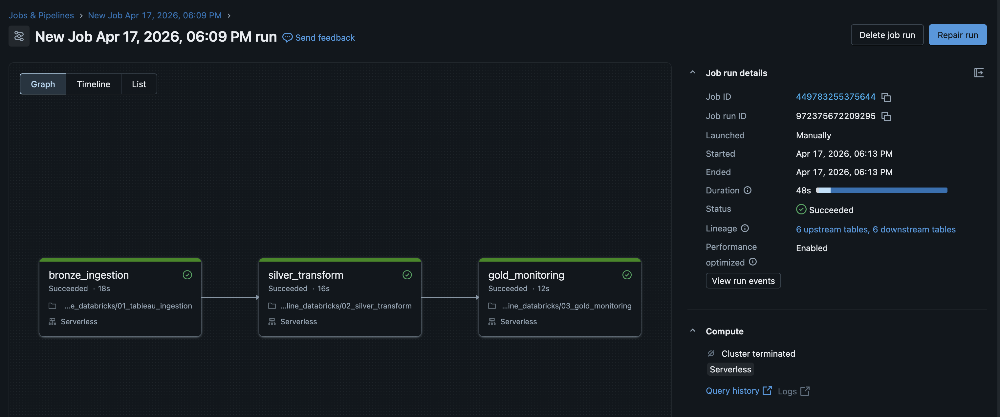

# Tableau Metadata Monitoring Pipeline — Databricks Edition

## Repository Contents
- `notebooks/01_tableau_ingestion.py` — Python ingestion notebook for extracting Tableau Cloud metadata and loading bronze Delta tables
- `notebooks/02_silver_transform.sql` — SQL transformations for silver-layer standardization and enrichment
- `notebooks/03_gold_monitoring.sql` — SQL transformation for the final gold monitoring table
- `images/databricks_workflow_success.png` — screenshot of the successful Databricks workflow run
- `images/gold_bi_asset_monitoring.png` — screenshot of the final gold monitoring table
- `README.md` — project overview, architecture, medallion design, orchestration, and implementation details
- `requirements.txt` — Python dependency used in the ingestion notebook
- `.gitignore` — excludes local environment and temporary files from version control

## Overview
This project is the Databricks-based Version 2 of the Tableau Metadata Monitoring Pipeline.

The goal of this version was to evolve the original local implementation into a more scalable, platform-aligned design using Databricks. The pipeline ingests Tableau Cloud metadata through the Tableau REST API, lands raw records into bronze Delta tables, standardizes and enriches them in silver, and builds a final gold monitoring table for downstream BI monitoring, governance, and asset health analysis.

Compared with the local version, this implementation introduces:
- Delta-based storage
- medallion-style data modeling
- Databricks secret scope management
- Databricks workflow orchestration
- clearer separation between ingestion, transformation, and serving layers

### Successful Databricks Workflow Run


## Why I Built This Version
The first version of this project was designed as a lightweight local pipeline using Python, SQLite, and Airflow. That version demonstrated the full logic clearly and was easy to review.

This Databricks version was built to show how the same Tableau metadata use case could be adapted to a more scalable data platform. The objective was not just to move the code into Databricks, but to redesign the solution in a way that better reflects modern data engineering practices: layered storage, workflow orchestration, secure secret management, and separation of raw and modeled data.

## Architecture
The pipeline follows a medallion-style design:

- **Python ingestion** authenticates to Tableau Cloud and extracts workbook and view metadata through the Tableau REST API.
- **Bronze tables** store the raw landed metadata in Delta format.
- **Silver tables** standardize field names, cast data types, and enrich view metadata with workbook-level context.
- **Gold table** creates the final monitoring-ready BI asset dataset with business-friendly status logic.
- **Databricks Workflow** orchestrates the bronze, silver, and gold steps in sequence.

## High-Level Flow:

```text
Tableau REST API
        ↓
Python ingestion notebook
        ↓
bronze_tableau_workbooks / bronze_tableau_views
        ↓
silver_tableau_workbooks / silver_tableau_views / silver_tableau_assets_enriched
        ↓
gold_bi_asset_monitoring
        ↓
Databricks Workflow orchestration
```

## Bronze Layer
The bronze layer stores raw Tableau metadata in Delta tables:

- `bronze_tableau_workbooks`
- `bronze_tableau_views`

This layer preserves the landed metadata close to source shape while flattening nested API fields enough to support downstream transformations.

The bronze ingestion logic is implemented in `01_tableau_ingestion.py`.

## Bronze Responsibilities

- authenticate to Tableau Cloud using a PAT
- fetch workbook and view metadata with pagination
- flatten nested API responses
- land raw records into Delta tables
- preserve source fidelity for reprocessing and downstream transformations

## Silver Layer
The silver layer standardizes and enriches the bronze metadata. It creates:

- `silver_tableau_workbooks`
- `silver_tableau_views`
- `silver_tableau_assets_enriched`

The purpose of the silver layer is to:

- standardize column names
- cast timestamps into usable data types
- infer or preserve workbook context for views
- enrich views with workbook-level fields such as project and owner
- normalize workbook matching logic
- prepare the data for final business-facing monitoring logic

The silver transformations are implemented in `02_silver_transform.sql`.

## Silver Responsibilities

- convert raw metadata into cleaner analytical structures
- reduce inconsistencies between workbook and view records
- enrich incomplete view records with workbook-level attributes
- make the dataset easier to consume in reporting and downstream monitoring

## Gold Layer
The gold layer creates the final analytics-ready monitoring table:

- `gold_bi_asset_monitoring`

This table includes:
- `asset_id`
- `asset_name`
- `asset_type`
- `workbook_name`
- `project_name`
- `owner_name`
- `owner_id`
- `last_updated`
- `last_viewed`
- `views_last_30d`
- `total_views`
- `refresh_status`
- `status`
- `last_synced_at`

The `status` field is derived to support BI monitoring use cases such as identifying stale, unused, or failing assets.

The gold transformation is implemented in `03_gold_monitoring.sql`.

## Final Gold Monitoring Table

Gold BI asset monitoring table

## Status Logic

The gold table includes a derived status field to make the dataset immediately useful for monitoring and governance workflows.

Current logic:

- `failing_refresh` if refresh status is failed
- `unused` if usage is zero where usage data is available
- `stale` if the asset has not been updated recently
- `active` otherwise

This makes the final model more useful than raw metadata alone, because it supports direct monitoring use cases without requiring downstream users to recreate business rules.

## Secret Management

Tableau credentials are stored in a Databricks secret scope rather than being hardcoded in the notebook.

The project uses the secret scope:

- `tableau-metadata-scope`

with keys:
- `tableau_server`
- `tableau_site_content_url`
- `tableau_pat_name`
- `tableau_pat_secret`

This keeps sensitive credentials out of notebook code and aligns the project more closely with production-style secret handling.

## Workflow Orchestration
The pipeline is orchestrated in Databricks using a workflow with three dependent tasks:

1. `bronze_ingestion`
2. `silver_transform`
3. `gold_monitoring`

Task dependency flow:

```text
bronze_ingestion -> silver_transform -> gold_monitoring
```

This workflow design provides:

- clear task dependencies
- repeatable execution
- run history and visibility
- a cleaner production-oriented structure than running notebooks manually

## Design Decisions

One important design decision in this version was to separate raw ingestion from modeled outputs using medallion layers rather than writing directly to a single final table.

I chose this design because it:

- makes the pipeline easier to debug
- preserves raw landed data
- supports reprocessing if logic changes
- reflects a more realistic enterprise data platform structure
- cleanly separates ingestion concerns from transformation concerns

Another design decision was to keep Tableau extraction in Python while moving modeling into SQL. Python is better suited to API authentication, pagination, and JSON handling, while SQL is better suited to layered analytical transformations and reusable table definitions.

## Challenges and Lessons Learned

A key challenge in the project was handling incomplete metadata returned at the view level. Some Tableau view records did not include enough workbook-level context to fully populate fields like workbook name, project, or owner.

To address this, I implemented enrichment logic that infers and backfills workbook context from related metadata. This improved the completeness and usability of the final gold table and reinforced the importance of layered transformations instead of relying only on raw source responses.

## Comparison to Version 1

**Version 1:**

- Python
- Tableau REST API
- SQLite
- CSV export
- Airflow orchestration

**Version 2:**

- Python ingestion in Databricks
- Delta bronze tables
- SQL silver and gold transformations
- Databricks secret scope management
- Databricks workflow orchestration

Version 1 was optimized for clarity and lightweight end-to-end implementation. Version 2 was optimized for scalability, platform alignment, and medallion-style data modeling.
